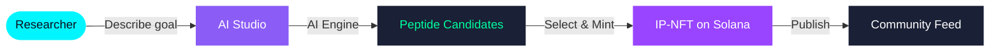

# Peptimus

**Decentralized AI Peptide Design on Solana**

*Design. Evolve. Own. The future of peptide research is on-chain.*

---

## What is Peptimus?

Peptimus is an AI-powered platform for peptide sequence design, evolution, and on-chain IP ownership. Researchers describe a therapeutic goal in plain language — the AI generates candidate sequences, scores them for binding affinity, stability, novelty, and toxicity, then mints the best candidates as compressed NFTs on Solana at under $0.001 per mint.

---

## How it works

---

## Repositories

| Repository | Description | Stack |
|---|---|---|
| [peptimus](https://github.com/peptimus/peptimus) | Main web application | React 18 · Vite · Tailwind · Three.js · Framer Motion |
| [peptimus-api](https://github.com/peptimus/peptimus-api) | REST API + database layer | Express 5 · PostgreSQL · Drizzle ORM |
| [peptimus-shared](https://github.com/peptimus/peptimus-shared) | Shared TypeScript packages | OpenAPI Spec · Zod v4 · TanStack Query |
| [peptimus-infra](https://github.com/peptimus/peptimus-infra) | Monorepo root & infrastructure | pnpm workspace · GitHub Actions · Node.js 24 |

---

## Tech Stack

| Layer | Technologies |
|---|---|
| **Frontend** | React 18, Vite, Tailwind CSS, Framer Motion, React Three Fiber, Wouter, Zustand |
| **Blockchain** | Solana Mainnet, Metaplex Bubblegum v5, Jupiter Unified Wallet, cNFT IP-NFT |
| **Backend** | Express 5, PostgreSQL, Drizzle ORM, Pino Logger |
| **Shared** | TypeScript 5.9, OpenAPI Spec, Zod v4, TanStack Query |
| **Infra** | pnpm workspace, Node.js 24, GitHub Actions CI |

---

## Roadmap

| Period | Milestone |
|---|---|
| Q2 2026 | AI Peptide Design Studio · IP-NFT Minting on Solana · Community Feed |
| Q3 2026 | PTMS Token Launch · Bounty Program · Peptide Comparison Tool |
| Q4 2026 | DAO Governance · Smart Contract Bounty Validation · Reputation System |
| Q1 2027 | Partner Protocol Integrations · Cross-chain IP-NFT Bridging · Enterprise API |

---

## Cost per Peptide

| Action | Cost |
|---|---|
| AI Design (~1100 tokens) | ~$0.001 |
| DB Storage (1 row, ~500 bytes) | ~$0.0001 |
| NFT Mint (Solana cNFT via Bubblegum) | ~$0.001 |
| **Total end-to-end** | **~$0.002** |

---

**Built by [peptimusdev](https://github.com/peptimusdev)**

